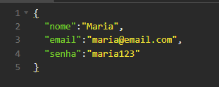
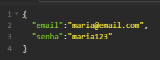
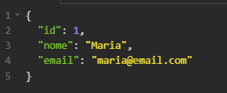
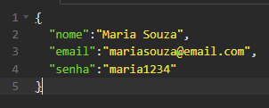

<h1 align="center"> VendiX </h1>
<p align="center">

</p>

## 🚀 Acompanhe o Projeto

O objetivo deste projeto é criar uma API para um PDV (Frente de Caixa).

<!--
<p>Este projeto foi proposto como desafio final do curso de Desenvolvimento de Software com Foco em Backend, ofertado pela Cubos Academy em parceria com o Ifood.</p>

<i>Trello utilizado pelo grupo: https://trello.com/b/UznHg8RW/five-devs-desenvolvimento-pdv</i> -->

## Índice

- <a href="#hammer-funcionalidades-do-projeto"> Funcionalidades do projeto </a>

- <a href="#📋-como-rodar-este-projeto"> Como rodar este projeto</a>

- <a href="#🛠️-tecnologias-utilizadas">Tecnologias utilizadas</a>

- <a href="#controle-de-versão"> Controle de versão </a>

- <a href="#✒️-autores"> Autores </a>

## :hammer: Funcionalidades do projeto

<strong> `Listar categorias`</strong>
`GET\categorias`:

Permite listar todas as categorias dos produtos cadastradas no banco de dados.

 <p> * Informática  * Celulares  * Beleza e Perfumaria * Mercado * Livros e Papelaria * Brinquedos * Moda * Bebê * Jogos


<strong> `Cadastrar usuário`</strong>
`POST\usuario`:

Esta funcionalidade será utilizada para cadastrar um novo usuário no sistema.



<strong> `Efetuar login do usuário`</strong>
`POST\login`:

Esta funcionalidade permite o usuário cadastrado realizar o login no sistema.



⚠️ Para detalhar ou editar o perfil do usuário será exigido um token de autenticação no header da requisição

<strong> `Detalhar perfil do usuário`</strong>
`GET\usuario`:

Essa funcionalidade permite o usuário logado a visualizar os dados do seu próprio perfil, de acordo com a validação do token de autenticação.



<strong> `Editar perfil do usuário logado`</strong>
`PUT\usuario`:

Essa funcionalidade permite o usuário logado atualizar informações de seu próprio cadastro, de acordo com a validação do token de autenticação.



## 📋 Como rodar este projeto

```bash
# Clone este repositório
$ git clone https://github.com/isadeop/VendiX

# Acesse a pasta do projeto no seu terminal
$ cd VendiX

# Instale as dependências
$ npm install

# Execute a aplicação
$ npm run start

# A aplicação será iniciada na porta 3000: http://localhost:3000
```

## 🛠️ Tecnologias utilizadas

1. [JavaScript](https://developer.mozilla.org/pt-BR/docs/Web/JavaScript)
2. [Node](https://nodejs.org/pt-br/about)
3. [ElephantSQL](https://www.elephantsql.com/docs/index.html)
4. [Insomnia](https://docs.insomnia.rest/insomnia/get-started)

## Controle de versão

1.0.0.0

## ✒️ Autores

- **Alaene Pereira** - https://github.com/alaenepereira
- **Amanda Santos** - https://github.com/amandasantos05
- **Cristiane Nutini** - https://github.com/CrisNutini
- **Helen Cristina Araujo** - https://github.com/helen-araujo
- **Isadora de Oliveira** - https://github.com/isadeop
