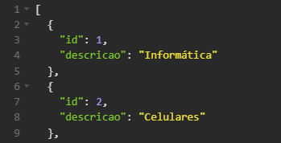

<h1 align="center"> VendiX </h1>

## 🚀 Descrição do Projeto
O objetivo deste projeto é criar uma API para um PDV (Frente de Caixa). 

Este projeto foi proposto como desafio final do curso de Desenvolvimento de Software com Foco em BackEnd, ofertado pela Cubos Academy em parceria com o Ifood. 

<i>Trello utilizado pelo grupo: https://trello.com/b/UznHg8RW/five-devs-desenvolvimento-pdv</i>

## ✒️ Autores

* **Alaene Pereira** - https://github.com/alaenepereira
* **Amanda Santos** - https://github.com/amandasantos05
* **Cristiane Nutini** - https://github.com/CrisNutini
* **Helen Cristina Araujo** - https://github.com/helen-araujo
* **Isadora de Oliveira** - https://github.com/isadeop

## :hammer: Funcionalidades do projeto
<strong> `Listar Categorias`</strong> 
`GET\categorias`:
 Serão previamente cadastradas no Banco de Dados as categorias dos protudos. Está funcionalidade permite listar todas as categorias cadastradas
 
 * Informática  * Celulares  * Beleza e Perfumaria * Mercado * Livros e Papelaria * Brinquedos * Moda * Bebê * Jogos 
 
 Exemplo de resposta da requisição:

 
## 📋 Como rodar este projeto

